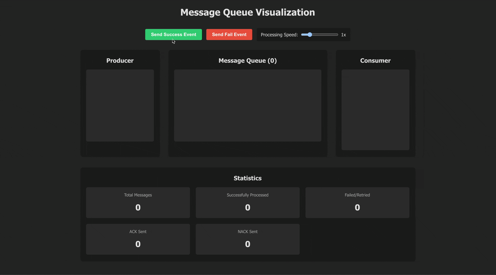

# Message Queue Visualization

Simple visualization demonstrating how a message queue works.



## Features

- Visual representation of a message queue system
- Producer component that sends messages to the queue
- Queue component that stores messages until they can be processed
- Consumer component that processes messages and handles acknowledgments
- Support for success and failure scenarios
- Message retry mechanism for failed processing
- Visual statistics dashboard

## Technical Implementation

The application demonstrates key concepts of message queues:

- Message publishing
- Message consumption
- Processing acknowledgments (success/failure)
- Retry logic for failed messages

## How to Run

1. Install dependencies:
```
npm install
```

2. Start the development server:
```
npm run dev
```

3. Open the provided URL in a web browser

## How to Use

1. Use the "Send Success Event" button to send a message that will process successfully
2. Use the "Send Fail Event" button to send a message that will fail during processing
3. Observe how messages move through the system, including retry attempts for failed messages
4. Use the speed control slider to adjust the processing speed for demonstration purposes

## Statistics

The application tracks and displays:

- Total messages sent
- Messages successfully processed
- Messages that failed and were retried
- ACKs sent (acknowledgments for successful processing)
- NACKs sent (negative acknowledgments for failed processing)

## How Message Queues Work

Message queues are a powerful communication mechanism that enables asynchronous communication between different parts of a distributed system. Here's a brief overview of how they work:

### Core Components

1. **Producer**: The component that creates and sends messages to the queue. In real-world applications, producers might be web servers, IoT devices, or any application generating events.

2. **Queue**: A buffer that temporarily stores messages until they can be processed. The queue follows a First In, First Out (FIFO) approach, ensuring messages are processed in the order they were received.

3. **Consumer**: The component that retrieves messages from the queue and processes them. In production systems, consumers might be services that process orders, send emails, or perform data analysis.

### Message Flow

1. The Producer sends a message to the Queue
2. The message sits in the Queue until a Consumer is ready to process it
3. The Consumer retrieves the message and processes it
4. The Consumer sends an acknowledgment back to the Queue

### Acknowledgments (ACK/NACK)

**ACK (Acknowledgment)**: When a Consumer successfully processes a message, it sends an ACK back to the queue. This tells the queue that the message can be safely removed because processing was completed successfully.

**NACK (Negative Acknowledgment)**: If a Consumer fails to process a message, it sends a NACK to the queue. This signals that the message processing failed and the message should be either:
- Returned to the queue for retry
- Moved to a dead letter queue (DLQ) after multiple failed retry attempts
- Handled according to a specific error policy

### Retry Mechanism

When a message processing fails (resulting in a NACK), the queue can:
1. Requeue the message for another attempt
2. Apply a backoff strategy to avoid immediate retries
3. Track the number of retry attempts
4. Remove messages from the main queue after exceeding a maximum retry count

### Benefits of Message Queues

- **Decoupling**: Producers and consumers can operate independently
- **Scalability**: Multiple consumers can process messages in parallel
- **Resilience**: Messages aren't lost even if a consumer fails
- **Load Leveling**: Handles traffic spikes by temporarily storing messages
- **Ordering**: Maintains sequence for operations that need to be processed in order

